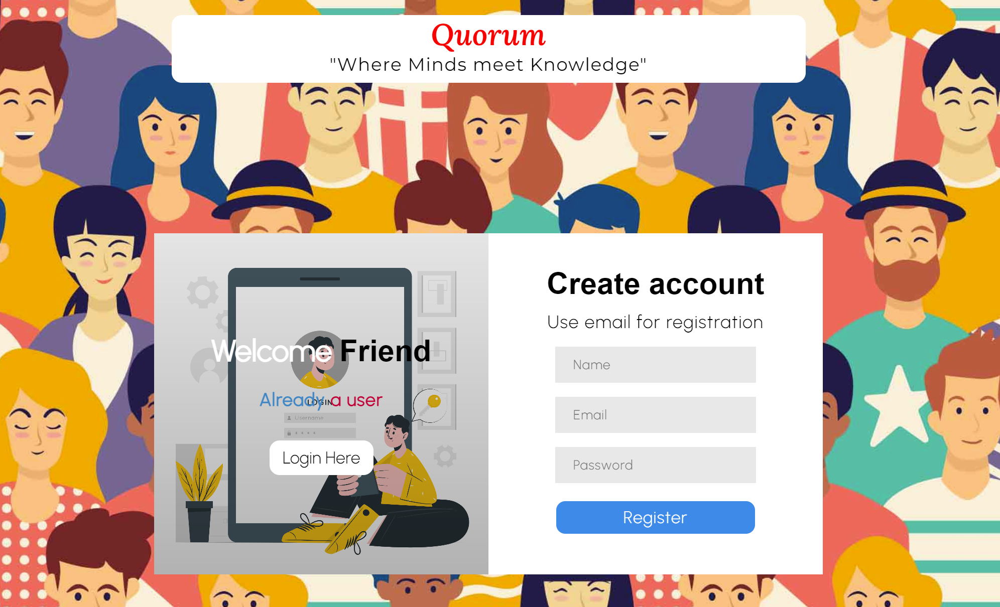
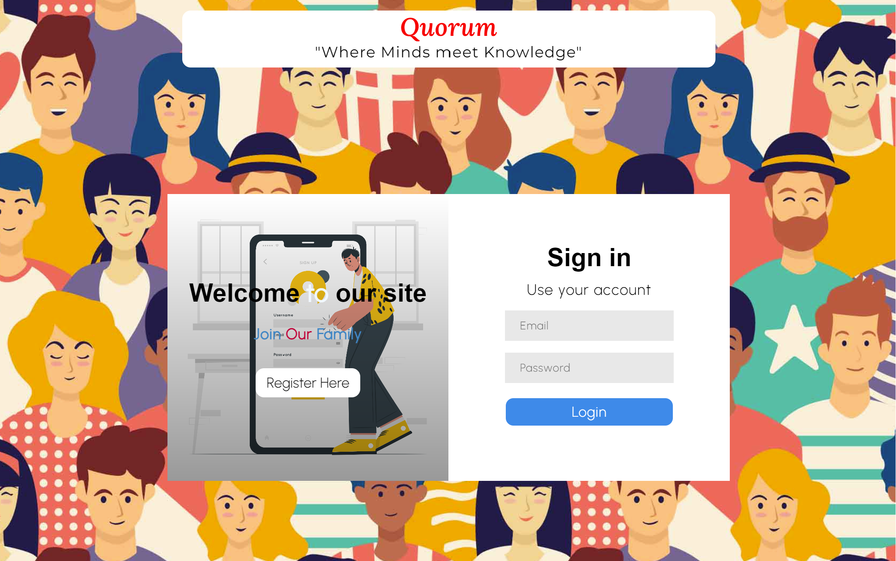
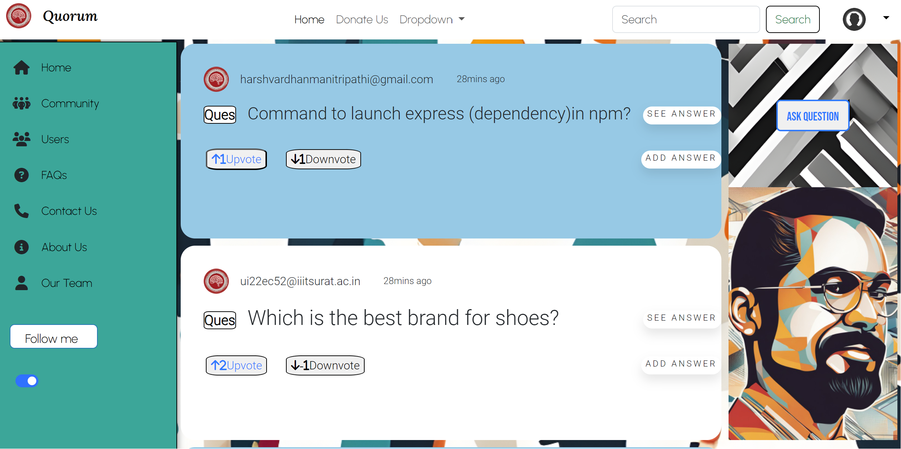
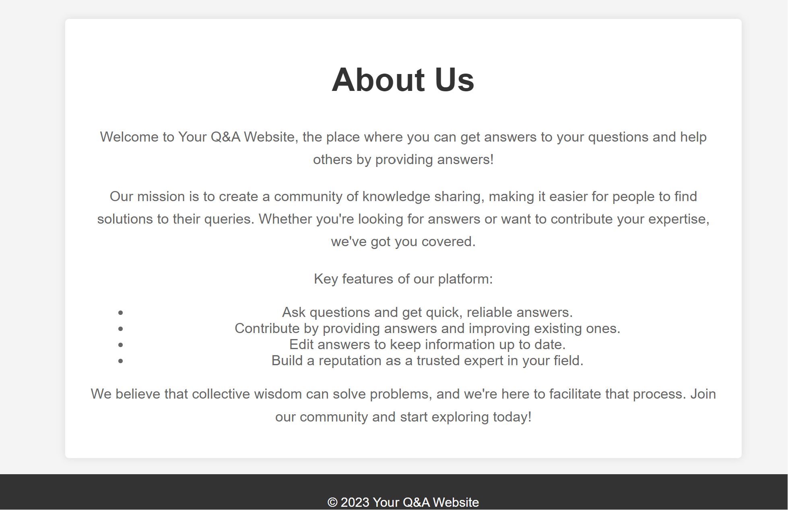
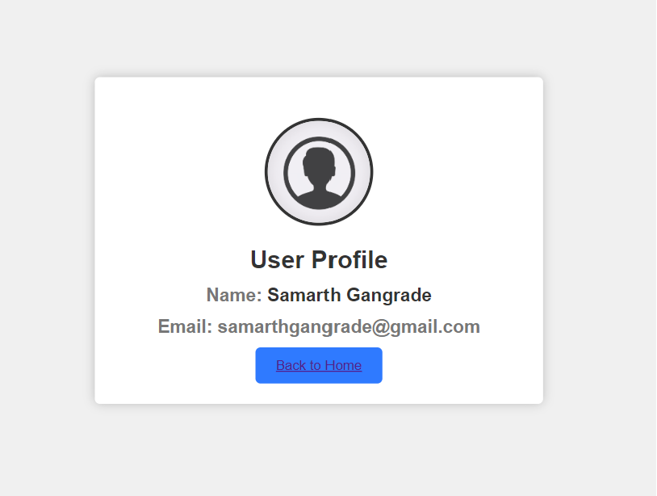
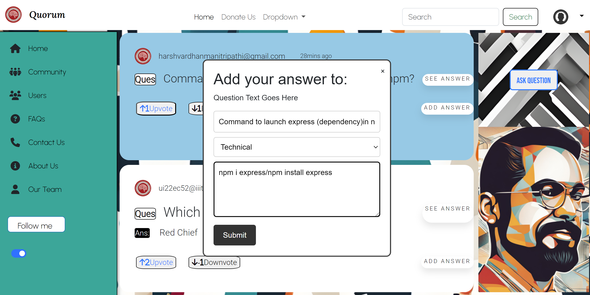
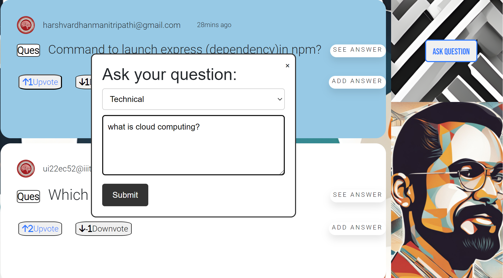
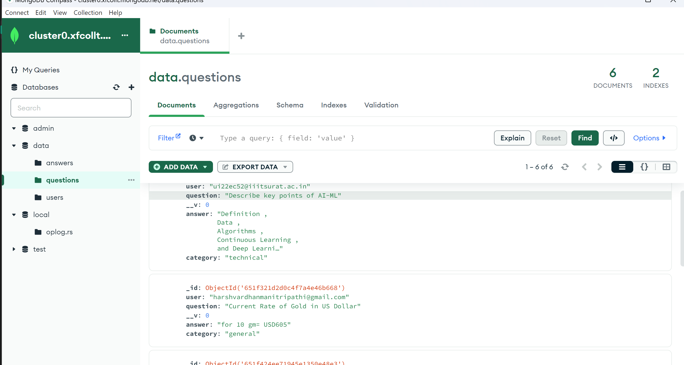

# Quorum by DevGuyz
            An Answer Voyage website

# Introduction

"Quorum" is a user-driven website where users can ask questions, receive answers, upvote/downvote responses, and contribute their own answers. It promotes knowledge sharing and community engagement, allowing users to find solutions to a wide range of topics while maintaining a reputation system for quality contributions."

# Quick Start

Clone this repo :
HTTPS:
 ```sh  
  https://github.com/SamarthGangrade22/Devheat_Beta_DevGuyz.git 
  ```
SSH:
 ```sh   
 git@github.com:SamarthGangrade22/Devheat_Beta_DevGuyz.git 
 ```

Install all rquired dependencies

```sh
npm Install
```
To run the Website
```sh
npm i nodemon
```
```sh
npm i express
```
```sh
npm i mongoose
```
```sh
npm i bcrypt
```
```sh 
npm i body-parser
```

Our website runs on the browser with localhost:4000

```sh 
http://localhost:4000/
```
# Key features

**Ask Questions**: Users can post questions on a wide range of topics, seeking solutions and insights from the community.

**Receive Answers**: Knowledgeable community members provide answers to posted questions, offering explanations, solutions, and guidance.

**Upvote and Downvote**: Users can express their approval or disapproval of answers by upvoting or downvoting them. This helps highlight the most helpful and accurate responses.

**Add Answers**: Anyone can contribute their own answers to questions, enriching the pool of knowledge available on the platform.

**Search and Categories**: A powerful search feature and categorization system make it easy for users to find relevant questions and answers.

**Moderation**: To maintain a high-quality environment, the platform includes a moderation system to flag and remove inappropriate or spam content.

**User Profiles**: Users have their own profiles displaying their contributions, reputation, and activity history.

# Technology Used

## Frontend
- HTML
- CSS
- Javascript
- Bootstrap
- Font Awesome

By using Above Technologies we make our website responsive for different screen types

## Backend
- At the backend of the application , a Node JS framework is used/continously running which manages to raise requests and responses from user

#### Mongoose
Allows a server communication to permit exchange of resources and to store and collect data from the saved resources

#### Express
-Creates a web-server
-Handles requests and responses

#### Bycrypt
-Used to generate hashed passwords

#### Body-Parsar
is used to handle HTTP POST requests

## Database
We are using **MongoDB** for all its databases needs .In this project the use of database is confined to :
**Integrates real-time data monitering** of questions posted in the database by the current user or previous user.

**User profile** : building or storing of user data/credentials for safe and secure web browsing  and for better communication with user.

**User Inputs** : Receives input and provied the expected output by suppliy the resources.

# Demo

**Sign in and Sign Up page**
<br><br>
<br><br>
**Home page**
<br><br>
**About Us**
<br><br>
**Profile**

**AnswerModal**
<br><br>
**Question Modal**
<br><br>
**MongoDB**
<br><br>
<br><br>

**Running Website demo(Mobile Recording)**
<br><br>
**Screen recording**
```sh
https://www.loom.com/share/65083fa4444245b2b631d7648dba97b6
```
# Scalability


- To apply category and question related search thus allowing user to have ease in searching the data.

- To develop a post section or Blog section for intellectual people to post or share their beholding knowledge.

- we can provide a community section on the basis of field of specific topics.

- We can impelement notification system in which if someone Answer the question user gets notifications.

- We can also give rewards or points to user on the basis of questions answered,  which they can reedem further to get schwags and all.

- we can implement a school/college section by which particular college can make community of their student and can discuss about college related stuffs.